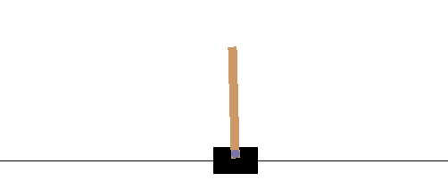

BlobRL : Reinforcement Learning library with Pytorch
============


[](https://pypi.org/project/blobrl/)
[](https://blobrl.readthedocs.io/en/latest/?badge=latest)
[](https://travis-ci.org/french-ai/reinforcement)
[](https://www.codefactor.io/repository/github/french-ai/reinforcement)
[](https://codecov.io/gh/french-ai/reinforcement)
[](https://discord.gg/f5MZP2K)
[](https://github.com/french-ai/reinforcement/blob/master/LICENSE)

BlobRl is a modular library for reinforcement learning which works on pytorch.

## Installation

### Pytorch

For installing *pytorch* follow [Quick Start Locally](https://pytorch.org/) for your config.

### BlobRL
Install blobrl

- to use it:

```bash
pip install blobrl
```

- to use it on notebook:

```bash
pip install blobrl[notebook]
```

- to help development:

```bash
pip install blobrl[dev]
```

## Get Started
### Initialize environment
```python
import gym
env = gym.make("CartPole-v1")
```

### Initialize agent

```python
from blobrl.agents import AgentRandom
action_space = env.action_space
observation_space = env.observation_space
agent = AgentRandom(observation_space=observation_space, action_space=action_space)
```

### Train 

Create Trainer
```python
from blobrl import Trainer
trainer = Trainer(environment=env, agent=agent, log_dir="./logs")
```
Start training:
```python
trainer.train(max_episode=100, nb_evaluation=4, render=True)
```

### Watch metrics
Visualize training and evaluation metrics:
```bash
tensorboard --logdir logs
```

## Environments

We will use GYM environments for moments.

Watch [TODO](./TODO.md#environments-list) for environments in coming.

## Agents

Agent implemented:
- AgentConstant, this agent choice one random action on start and will take her all next time
- AgentRandom, this agent choice one random action each time
- DQN, Deep Q Learning (Mnih *et al.*, [2013](https://arxiv.org/abs/1312.5602))
- DoubleDQN, (van Hasselt *et al.*, [2016](https://arxiv.org/abs/1509.06461))
- DuelingDQN, (Wang *et al.*, [2016](https://arxiv.org/abs/1511.06581))
- CategoricalDQN, (Bellamare *et al.*, [2017](https://arxiv.org/abs/1707.06887))

## Examples

You can find all examples [here](./examples)
- [Jupyter exemple](./examples/example_train_jupyter.ipynb)
- [Colab exemple](./examples/example_colab.ipynb)


## Results



You can see more [results](./results/README.md) and analysis

