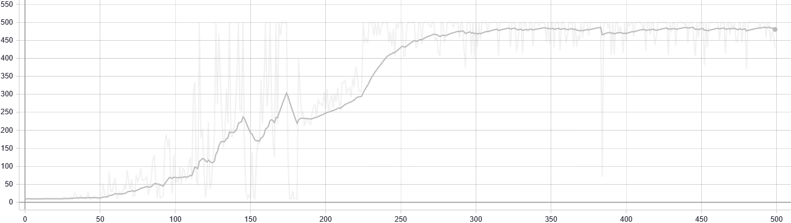
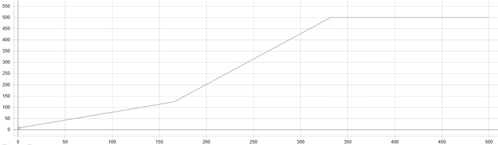

# Results

All results is show in this directory.

There are one subdirectory by environment used.

## CartPole

Example with agent: DQN, network: SimpleNetwork,  Algo: Adam, Memorie: ExperienceReplay(max_size=32), Step train: 1, Batch size: 64, Gamma: 0.99, Exploration: EpsilonGreedy(0.1), Learning rate: 0.001


* Training graph

* Evaluation graph


### Parameters range

We test to train all this agent with this parameters.

We train agent with 300 max_step.
* Agent
  * Algo : [DQN, DoubleDQN, DuelingDQN, CategoricalDQN]

  * Step train : [1, 4, 32]
  
  * Batch size : [1, 32, 64]
  
  * Gamma : [0.99]
  
  * Exploration : [EpsilonGreedy(0.1),
                         EpsilonGreedy(0.6),
                         AdaptativeEpsilonGreedy(0.3, 0.1, 50000, 0),
                         AdaptativeEpsilonGreedy(0.8, 0.2, 50000,² 0)]
* Network

For _DQN, DoubleDQN_ : SimpleNetwork

For _DuelingDQN_ : SimpleDuelingNetwork

For _CategoricalDQN_ : C51Network
* Optimizer
  * Algo : Adam
  * Learning rate : [0.1, 0.001, 0.001]
* Memories
  * Algo : [ExperienceReplay]

### Result analysis

We stop training at 500 step. We can find differant result if we add more training step.

#### Agent performance

DQN, DoubleDQN and DuelingDQN can reach in 500(max) steps. CategoricalDQN reach ~400 steps.


* DQN

500 step is read with after 166 episode with this parameters.

| algo | step_train | batch_size | gamma | greedy_exploration | network | optimizer | lr | memories | max_size | step | max | min | avg | sum | 
| --- | --- | --- | --- | --- | --- | --- | --- | --- | --- | --- | --- | --- | --- | --- | 
| DQN | 1.0 | 32.0 | 0.99 | AdaptativeEpsilonGreedy-0.3-0.1-50000-0 | SimpleNetwork | Adam | 0.0010 | ExperienceReplay | 128 | 166.0 | 1.0 | 1.0 | 1.0 | 500.0 | 
| DQN | 1.0 | 64.0 | 0.99 | EpsilonGreedy-0.1 | SimpleNetwork | Adam | 0.0010 | ExperienceReplay | 16 | 166.0 | 1.0 | 1.0 | 1.0 | 500.0 | 
| DQN | 32.0 | 64.0 | 0.99 | AdaptativeEpsilonGreedy-0.3-0.1-50000-0 | SimpleNetwork | Adam | 0.1000 | ExperienceReplay | 16 | 166.0 | 1.0 | 1.0 | 1.0 | 500.0 | 

* DoubleDQN

Same for doubleDQN but less training reach 500 step and need more episode to reach that.

| algo | step_train | batch_size | gamma | greedy_exploration | network | optimizer | lr | memories | max_size | step | max | min | avg | sum | 
| --- | --- | --- | --- | --- | --- | --- | --- | --- | --- | --- | --- | --- | --- | --- | 
|DoubleDQN|1.0|64.0|0.99|EpsilonGreedy-0.6|SimpleNetwork|Adam|0.0001|ExperienceReplay|128|332.0|1.0|1.0|1.0|500.0|

* DuelingDQN

Only two train reach 500 for duelingDQN

| algo | step_train | batch_size | gamma | greedy_exploration | network | optimizer | lr | memories | max_size | step | max | min | avg | sum | 
| --- | --- | --- | --- | --- | --- | --- | --- | --- | --- | --- | --- | --- | --- | --- | 
|DuelingDQN|4.0|32.0|0.99|AdaptativeEpsilonGreedy-0.8-0.2-50000-0|SimpleDuelingNetwork|Adam|0.0001|ExperienceReplay|16 |498.0 |1.0|1.0|1.0|500.0|
|DuelingDQN|4.0|64.0|0.99|EpsilonGreedy-0.6|SimpleDuelingNetwork|Adam|0.0001|ExperienceReplay|32|498.0|1.0|1.0|1.0|500.0|

* CategoricalDQN

The best training reach 405 steps in one episode.

| algo | step_train | batch_size | gamma | greedy_exploration | network | optimizer | lr | memories | max_size | step | max | min | avg | sum | 
| --- | --- | --- | --- | --- | --- | --- | --- | --- | --- | --- | --- | --- | --- | --- | 
|CategoricalDQN|32.0|1.0|0.99|AdaptativeEpsilonGreedy-0.3-0.1-50000-0|C51Network|Adam|0.0010|ExperienceReplay|32|332.0|1.0|1.0|1.0|405.0|

#### Parameters importance

There are two principal parameters *batch size* and number of *step* trained. When is bigger, much we have best result.

LR and the number of times the model is trained is canceled. When one is large the other is smaller for equivalent results.

### Reproduce this result

```batch
python result.py --env "CartPole-v1" --max_episode 500
```

## Env2
*coming soon*