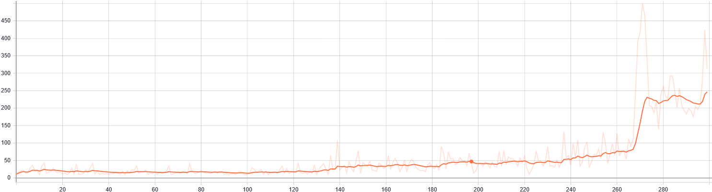
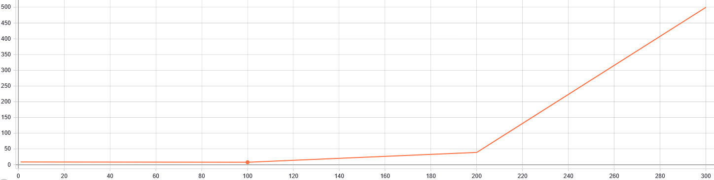

# Results

All results is show in this directory.

There are one subdirectory by environment used.

## CartPole

Example with agent: DQN, network: SimpleNetwork,  Algo: Adam, Memorie: ExperienceReplay(max_size=2048), Step train: 1, Batch size: 32, Gamma: 0.95, Exploration: AdaptativeEpsilonGreedy(0.8, 0.2, 10000, 0), Learning rate: 0.0001


* Training graph

* Evaluation graph


### Parameters range

We test to train all this agent with this parameters.

We train agent with 300 max_step.
* Agent
  * Algo : [DQN, DoubleDQN, CategoricalDQN]

  * Step train : [1, 32]
  
  * Batch size : [32, 64]
  
  * Gamma : [1.0, 0.99, 0.95]
  
  * Exploration : [EpsilonGreedy(0.1), EpsilonGreedy(0.6), AdaptativeEpsilonGreedy(0.3, 0.1, 30000, 0),
   AdaptativeEpsilonGreedy(0.8, 0.2, 10000, 0)]
   
* Network

For _DQN, DoubleDQN_ : SimpleNetwork, SimpleDuelingNetwork

For _CategoricalDQN_ : C51Network

* Optimizer
  * Algo : Adam
  * Learning rate : [0.1, 0.001, 0.0001]
* Memories
  * Algo : [ExperienceReplay]
  * max_size: [512, 2048]

### Result analysis

We stop training at 300 step. We can find different result if we add more training step.

#### Agent performance

DQN, DoubleDQN, CategoricalDQN can reach 500 rewards in 300 (max) steps.


* DQN

500 step is reach with after 100 episode with this parameters.

with SimpleNetwork:

| algo | step_train | batch_size | gamma | greedy_exploration | network | optimizer | lr | memories | max_size | step | max | min | avg | sum | 
| --- | --- | --- | --- | --- | --- | --- | --- | --- | --- | --- | --- | --- | --- | --- | 
|  DQN  |  1.0  |  32.0  |  0.95  |  EpsilonGreedy-0.6  |  SimpleNetwork  |  Adam  |  0.0010  |  ExperienceReplay  |  512  |  100.0  |  1.0  |  1.0  |  1.0  |  500.0  |
|  DQN  |  1.0  |  32.0  |  1.00  |  AdaptativeEpsilonGreedy-0.3-0.1-30000-0  |  SimpleNetwork  |  Adam  |  0.0010  |  ExperienceReplay  |  2048  |  100.0  |  1.0  |  1.0  |  1.0  |  500.0  |
|  DQN  |  1.0  |  32.0  |  1.00  |  EpsilonGreedy-0.6  |  SimpleNetwork  |  Adam  |  0.1000  |  ExperienceReplay  |  2048  |  100.0  |  1.0  |  1.0  |  1.0  |  500.0  |
|  DQN  |  1.0  |  64.0  |  0.99  |  AdaptativeEpsilonGreedy-0.3-0.1-30000-0  |  SimpleNetwork  |  Adam  |  0.0010  |  ExperienceReplay  |  2048  |  100.0  |  1.0  |  1.0  |  1.0  |  500.0  |
|  DQN  |  1.0  |  64.0  |  0.99  |  AdaptativeEpsilonGreedy-0.8-0.2-10000-0  |  SimpleNetwork  |  Adam  |  0.1000  |  ExperienceReplay  |  512  |  100.0  |  1.0  |  1.0  |  1.0  |  500.0  |
|  DQN  |  1.0  |  64.0  |  1.00  |  AdaptativeEpsilonGreedy-0.8-0.2-10000-0  |  SimpleNetwork  |  Adam  |  0.1000  |  ExperienceReplay  |  2048  |  100.0  |  1.0  |  1.0  |  1.0  |  500.0  |

with SimpleDuelingNetwork:

| algo | step_train | batch_size | gamma | greedy_exploration | network | optimizer | lr | memories | max_size | step | max | min | avg | sum | 
| --- | --- | --- | --- | --- | --- | --- | --- | --- | --- | --- | --- | --- | --- | --- | 
|  DQN  |  1.0  |  32.0  |  0.95  |  AdaptativeEpsilonGreedy-0.3-0.1-30000-0  |  SimpleDuelingNetwork  |  Adam  |  0.0010  |  ExperienceReplay  |  2048  |  100.0  |  1.0  |  1.0  |  1.0  |  500.0 |
|  DQN  |  1.0  |  32.0  |  0.95  |  AdaptativeEpsilonGreedy-0.8-0.2-10000-0  |  SimpleDuelingNetwork  |  Adam  |  0.0010  |  ExperienceReplay  |  512  |  100.0  |  1.0  |  1.0  |  1.0  |  500.0 |
|  DQN  |  1.0  |  32.0  |  0.95  |  EpsilonGreedy-0.1  |  SimpleDuelingNetwork  |  Adam  |  0.0010  |  ExperienceReplay  |  512  |  100.0  |  1.0  |  1.0  |  1.0  |  500.0 |
|  DQN  |  1.0  |  32.0  |  0.99  |  AdaptativeEpsilonGreedy-0.3-0.1-30000-0  |  SimpleDuelingNetwork  |  Adam  |  0.0010  |  ExperienceReplay  |  2048  |  100.0  |  1.0  |  1.0  |  1.0  |  500.0 |
|  DQN  |  1.0  |  32.0  |  0.99  |  AdaptativeEpsilonGreedy-0.3-0.1-30000-0  |  SimpleDuelingNetwork  |  Adam  |  0.0010  |  ExperienceReplay  |  512  |  100.0  |  1.0  |  1.0  |  1.0  |  500.0 |
|  DQN  |  1.0  |  32.0  |  0.99  |  AdaptativeEpsilonGreedy-0.8-0.2-10000-0  |  SimpleDuelingNetwork  |  Adam  |  0.0010  |  ExperienceReplay  |  2048  |  100.0  |  1.0  |  1.0  |  1.0  |  500.0 |
|  DQN  |  1.0  |  32.0  |  0.99  |  EpsilonGreedy-0.6  |  SimpleDuelingNetwork  |  Adam  |  0.0010  |  ExperienceReplay  |  512  |  100.0  |  1.0  |  1.0  |  1.0  |  500.0 |
|  DQN  |  1.0  |  64.0  |  0.95  |  AdaptativeEpsilonGreedy-0.3-0.1-30000-0  |  SimpleDuelingNetwork  |  Adam  |  0.0010  |  ExperienceReplay  |  2048  |  100.0  |  1.0  |  1.0  |  1.0  |  500.0 |
|  DQN  |  1.0  |  64.0  |  0.95  |  EpsilonGreedy-0.6  |  SimpleDuelingNetwork  |  Adam  |  0.0010  |  ExperienceReplay  |  2048  |  100.0  |  1.0  |  1.0  |  1.0  |  500.0 |
|  DQN  |  1.0  |  64.0  |  0.99  |  AdaptativeEpsilonGreedy-0.8-0.2-10000-0  |  SimpleDuelingNetwork  |  Adam  |  0.0010  |  ExperienceReplay  |  2048  |  100.0  |  1.0  |  1.0  |  1.0  |  500.0 |
|  DQN  |  1.0  |  64.0  |  0.99  |  EpsilonGreedy-0.6  |  SimpleDuelingNetwork  |  Adam  |  0.0010  |  ExperienceReplay  |  512  |  100.0  |  1.0  |  1.0  |  1.0  |  500.0 |
|  DQN  |  1.0  |  64.0  |  1.00  |  EpsilonGreedy-0.6  |  SimpleDuelingNetwork  |  Adam  |  0.0010  |  ExperienceReplay  |  2048  |  100.0  |  1.0  |  1.0  |  1.0  |  500.0 |

* DoubleDQN

500 step is reach with after 100 episode with this parameters with SimpleDuelingNetwork. 

with SimpleNetwork:

| algo | step_train | batch_size | gamma | greedy_exploration | network | optimizer | lr | memories | max_size | step | max | min | avg | sum | 
| --- | --- | --- | --- | --- | --- | --- | --- | --- | --- | --- | --- | --- | --- | --- | 
|  DoubleDQN  |  1.0  |  64.0  |  0.99  |  AdaptativeEpsilonGreedy-0.3-0.1-30000-0  |  SimpleNetwork  |  Adam  |  0.0010  |  ExperienceReplay  |  2048  |  200.0  |  1.0  |  1.0  |  1.0  |  500.0  |
|  DoubleDQN  |  1.0  |  64.0  |  1.00  |  EpsilonGreedy-0.6  |  SimpleNetwork  |  Adam  |  0.0010  |  ExperienceReplay  |  2048  |  200.0  |  1.0  |  1.0  |  1.0  |  500.0  |

with SimpleDuelingNetwork:

| algo | step_train | batch_size | gamma | greedy_exploration | network | optimizer | lr | memories | max_size | step | max | min | avg | sum | 
| --- | --- | --- | --- | --- | --- | --- | --- | --- | --- | --- | --- | --- | --- | --- | 
|  DoubleDQN  |  1.0  |  32.0  |  0.95  |  AdaptativeEpsilonGreedy-0.3-0.1-30000-0  |  SimpleDuelingNetwork  |  Adam  |  0.0010  |  ExperienceReplay  |  512  |  100.0  |  1.0  |  1.0  |  1.0  |  500.0  |

* CategoricalDQN

500 step is reach with after 100 episode with this parameters for only one training. It's less stable then other agent.

| algo | step_train | batch_size | gamma | greedy_exploration | network | optimizer | lr | memories | max_size | step | max | min | avg | sum | 
| --- | --- | --- | --- | --- | --- | --- | --- | --- | --- | --- | --- | --- | --- | --- | 
|  CategoricalDQN  |  32.0  |  32.0  |  0.99  |  AdaptativeEpsilonGreedy-0.8-0.2-10000-0  |  C51Network  |  Adam  |  0.0001  |  ExperienceReplay  |  2048  |  100.0  |  1.0  |  1.0  |  1.0  |  500.0  |

#### Parameters importance

There are three principal parameters *step* and number of *step* trained and learning rate.

### Reproduce this result

```batch
python result.py --env "CartPole-v1" --max_episode 300
```

## Env2
*coming soon*